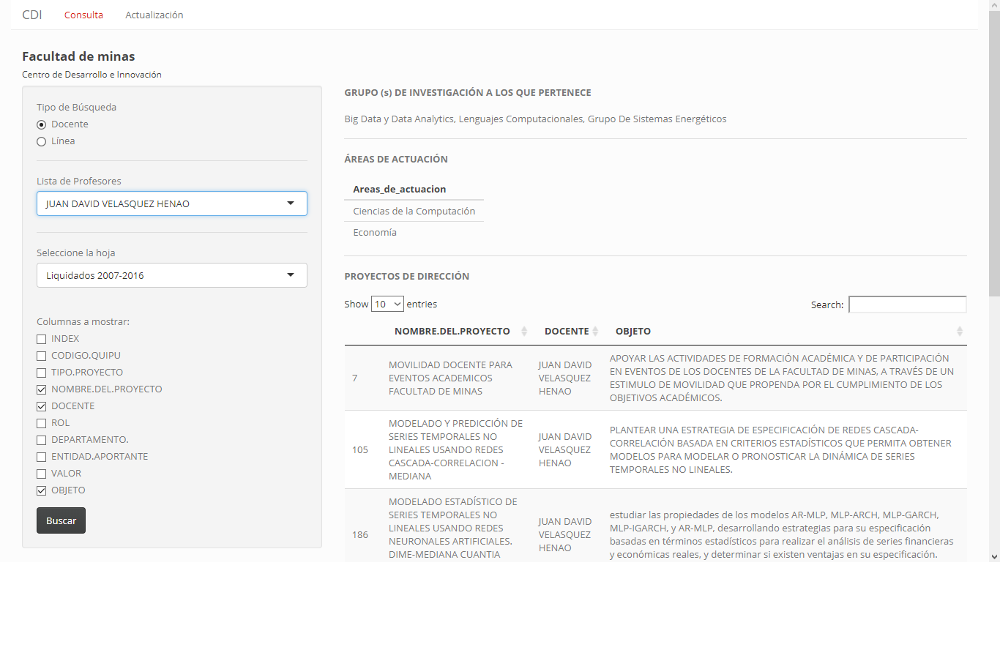
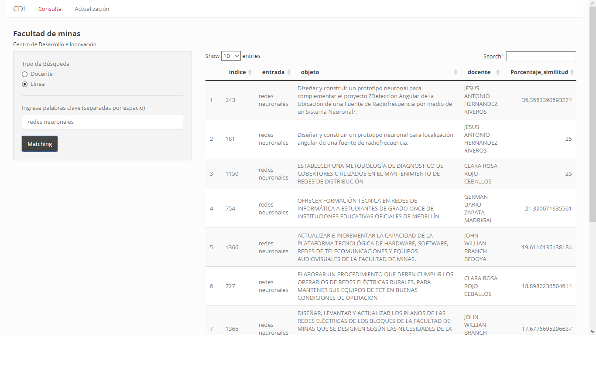
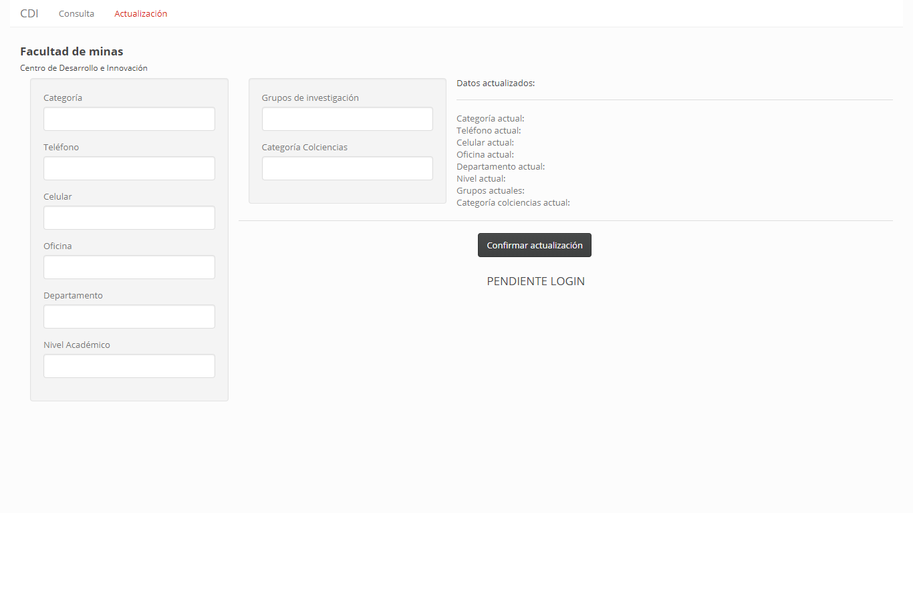

# Aplicativo-Shiny-CDI

[Enlace aplicación](https://adtamayop.shinyapps.io/Aplicativo_CDI_Beta/)

Aplicativo desarrollado en Shiny (R) para la Facultad de minas ( Centro de Desarrollo e Innovación )

Funciones:

* Filtrar información por profesor como:

    * Grupo de investigación a la que pertenece
    * Áreas de actuación a la que pertenece
    * Visualizar los proyectos que el docente ha desarrollado
    * Busqueda de proyectos por palabras claves utilizando minería de datos, el proceso utilizado fue el siguiente:

* Capturar conjuntos de datos
    1. Se crea el Corpus y se procede a la limpieza de datos utilizando la librería NLP de R
       * Texto a minúscula
       * Eliminación de tildes
       * Eliminación de números
       * Eliminación de stopwords (artículos)
       * Eliminación de signos de puntuación
       * Conversión de verbos en infinitivo
    2. Se crea la matriz de documentos de términos (DTM)
    3. Se aplican las métricas de similitud COSINE y EUCLIDEANA
    4. Se proyecta el resultado por Similitud

* Actualización de valores de una base datos (Aún no está completamente implementado)

  

